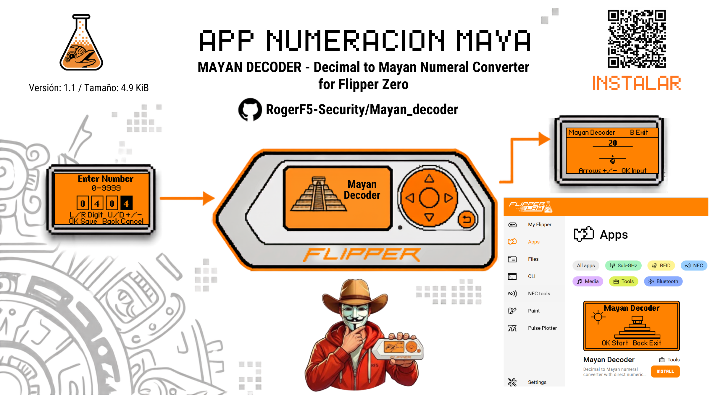

# Mayan Decoder

Mayan Decoder is an external `.fap` application for Flipper Zero that converts decimal numbers into Mayan numerals using the Flipper Canvas API.

Official catalog page: [Mayan Decoder on Flipper Lab](https://lab.flipper.net/apps/mayan_decoder)

## Features

- Decimal range: `0` to `9999`.
- Vigesimal conversion with vertically stacked Mayan levels.
- `0`: simple shell glyph.
- `1..4`: dots.
- `5..19`: horizontal bars plus remaining dots.
- Direct rendering through `ViewPort` and `Canvas`.
- Intro screen with simple Mayan pyramid artwork.
- Digit-based numeric input mode for larger values.

## How Mayan Numerals Work

Mayan numerals use a vigesimal, or base-20, counting system. Instead of using ten symbols like modern decimal notation, each digit from 0 to 19 is built from three simple visual elements:

- Shell: represents `0`.
- Dot: represents `1`.
- Bar: represents `5`.

Numbers from 1 to 19 are formed by combining dots and bars. For example, `7` is written as one bar (`5`) with two dots (`1 + 1`) above it. A value like `14` is two bars (`10`) plus four dots (`4`).

Larger numbers are stacked vertically. The lowest level is the ones position, the level above it is the twenties position, the next level is the four-hundreds position, and so on. This app uses a pure base-20 positional conversion:

```text
top levels     higher powers of 20
...
third level    20 x 20 = 400
second level   20
bottom level   1
```

Example: decimal `27` becomes one dot in the twenties level (`1 x 20`) and `7` in the bottom level (`5 + 2`). Read together, that is `20 + 7 = 27`.

Historical note: in the Classic Maya Long Count calendar, one calendar-specific position uses `18 x 20 = 360` to approximate the solar year. Mayan Decoder intentionally uses standard pure base-20 math because it is a decimal-to-numeral converter, not a calendar date converter.

## Historical Context

The Maya civilization developed one of the most sophisticated mathematical traditions of the ancient world. Their numeration system included an explicit zero symbol, centuries before zero became common in many other mathematical traditions. This made it possible to write large numbers compactly and to perform complex astronomical, calendrical, architectural, and administrative calculations.

Mayan numerals appeared in inscriptions, codices, monuments, and calendar records across Mesoamerica. The dot, bar, and shell notation is visually simple, but its positional structure is powerful: by stacking levels, the same small set of symbols can represent very large values.

## Controls

Intro screen:

- `OK`: enter the app.
- `Back`: exit.

Main screen:

- `Up` / `Right`: increment the number.
- `Down` / `Left`: decrement the number.
- `OK`: open numeric input.
- `Back`: exit the application.

Numeric input:

- `Left` / `Right`: select digit.
- `Up` / `Down`: increase or decrease the selected digit.
- `OK`: save the number.
- `Back`: cancel and return.

## Repository Structure

```text
.
+-- application.fam
+-- mayan_decoder.c
+-- assets
|   +-- generate_icon.py
|   +-- icon.png
+-- docs
|   +-- changelog.md
+-- img
|   +-- Banner.png
+-- screenshots
|   +-- ss0.png
|   +-- ss1.png
|   +-- ss2.png
|   +-- ss3.png
+-- README.md
```

## Build With uFBT

Install or update uFBT:

```sh
python -m pip install --upgrade ufbt
```

Clone and build:

```sh
git clone https://github.com/RogerF5-Security/Mayan_decoder.git
cd Mayan_decoder
ufbt
```

The compiled `.fap` will be generated in the `dist/` directory.

Build, upload, and run on a connected Flipper Zero:

```sh
ufbt launch
```

Update the uFBT SDK:

```sh
ufbt update
```

## Regenerate Icon

The FAP icon must be a 1-bit `10x10` PNG. To regenerate it:

```sh
python assets/generate_icon.py
```

## Catalog Assets

Screenshots are stored in `screenshots/` as unmodified qFlipper PNG captures for Flipper Application Catalog submission.

## License

MIT License.
